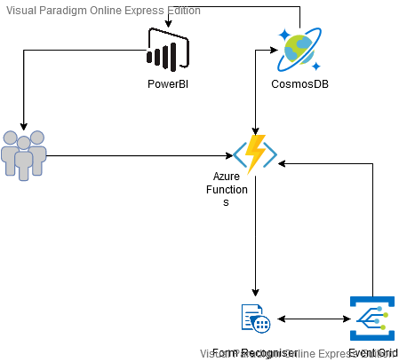

# Receipt-Manager

## Spis Treści:

1. [Opis projektu](#opis-projektu)
2. [Zespół](#zespół)
3. [Opis funkcjonalności](#opis-funkcjonalności)
4. [Architektura](#architektura)
5. [Wybrany stos technologiczny](#wybrany-stos-technologiczny)
6. [Rozpiska zadań](#rozpiska-zadań)

### Opis projektu: 

  Serwis umożliwiający archiwizację i kategoryzację paragonów. Użytkownik wysyła zdjęcie do serwisu, które zostaje zapisane do bloba, a następnie przetworzone przez form recognizer. Odpowiednie dane zostają wykorzystane do kategoryzacji i sortowania danych. Użytkownik ma dostęp do wyszukiwarki wgranych paragonów oraz wgląd w ogólne statystyki prezentowane przy pomocy wykresów z Power BI. 

### Zespół:

* Makowski Paweł: https://github.com/M4kPaul 

* Sulima Bartosz: https://github.com/sulimab 

### Opis funkcjonalności: 

* Przesyłanie zdjęć do blob 

* Wyciągnięcie danych ze zdjęć 

* Kategoryzacja danych 

* Dostęp do katalogu ze zdjęciami i danymi 

* Moduł wyszukiwania 

* Generowanie statystyk/wykresów 

### Architektura

### Wybrany stos technologiczny

* Storage Blobs

* Azure Logic App

* Form recognizer - https://docs.microsoft.com/pl-pl/azure/cognitive-services/form-recognizer/overview?tabs=v2-1 

* Na początku CosmosDB **uwaga na koszty**

#### Dodatki, do sprawdzenia: 

* Azure Cognitive Search - https://azure.microsoft.com/pl-pl/services/search/ 

* IntelligentKiosk - https://github.com/microsoft/Cognitive-Samples-IntelligentKiosk 

* https://jfk-demo.azurewebsites.net/ (https://github.com/microsoft/AzureSearch_JFK_Files) 

### Rozpiska zadań:

| Krok | Paweł Makowski | Bartosz Sulima | Status | Data |
| ---  |      :-:       |      :-:       |   :-:  |  :-: | 
| 1 | Przygotowanie wstępnego planu projektu | Przygotowanie wstępnego planu projektu | ✅ | 01.12.2020 05.12.2020 |
| 2 | Rozpisanie wstępnych artefaktów | Przygotowanie wstępnego diagramu architektury | ✅ | 05.12.2020 |
| 3 | Spotkanie #1 | Spotkanie #1 | ✅ | 05.12.2020 |
| 4 | Zapoznanie się z omówionymi serwisami | Zapoznanie się z omówionymi serwisami | ✅ | 05.12.2020 25.12.2020 |
| 5 | Aktualizacja artefaktów  i architektury | Aktualizacja artefaktów  i architektury | ✅ | 27.12.2020 |
| 6 | Ustawienie resource group i wstępnych serwisów | Ustawienie resource group i wstępnych serwisów | ✅ | 30.12.2020 |
| 7 | Połączenie Blob z Logic App i Form Recognizer |  | ✅ | 05.01.2020 |
| 8 | | Połączenie wyników z Form Recognizer z CosmosDB | ⏳ | |
| 9 | Połączenie CosmosDB z PowerBI | |
| 10 | Spotkanie #2 | Spotkanie #2 |
| 11 | //TODO? | //TODO? |
| 12 | Aktualizacja artefaktów/ diagramu architektury | Aktualizacja artefaktów/ diagramu architektury |
| 13 | Nagranie wideo | Nagranie wideo |
| 14 | Prezentacja | Prezentacja |

#### Extra: Oddanie raport video/ostani tydzień styczeń (również dla reszty grupy): 

    * Jak co działa, jakie modele, jakie problemy czy działa tylko usa 

    * Część AI, jak dotrenować
    
    * Sprzedać info o serwisach 

    * Diagram PowerBI + Form Recognizer 
