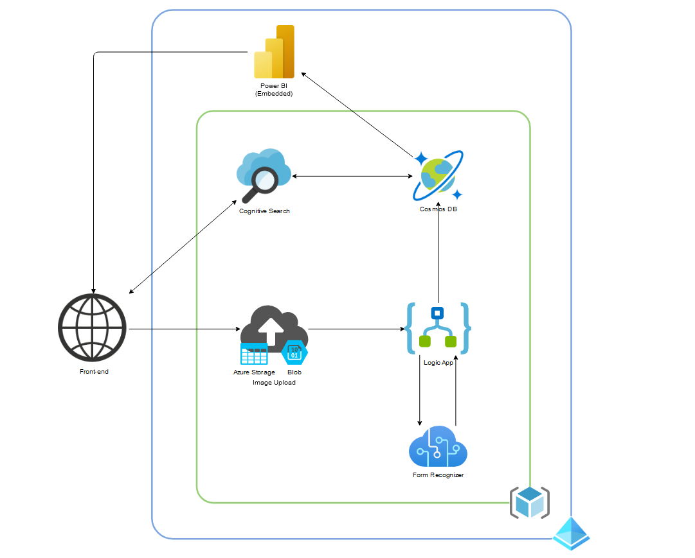

# Receipt-Manager

## Spis Treści:

1. [Opis projektu](#opis-projektu)
2. [Zespół](#zespół)
3. [Opis funkcjonalności](#opis-funkcjonalności)
4. [Architektura](#architektura)
5. [Wybrany stos technologiczny](#wybrany-stos-technologiczny)
   * [Storage Blobs](#storage-blobs)
   * [Azure Logic App](#azure-logic-app)
   * [Form recognizer](#form-recognizer)
   * [Cosmos DB](#cosmos-db)
	* [Power BI](#power-bi)
	* [Azure Cognitive Search](#azure-cognitive-search) 
6. [Rozpiska zadań](#rozpiska-zadań)

## Opis projektu: 

  Serwis umożliwiający archiwizację i kategoryzację paragonów. Użytkownik wysyła zdjęcie do serwisu, które zostaje zapisane do bloba, a następnie przetworzone przez form recognizer. Odpowiednie dane zostają wykorzystane do kategoryzacji i sortowania danych. Użytkownik ma dostęp do wyszukiwarki wgranych paragonów oraz wgląd w ogólne statystyki prezentowane przy pomocy wykresów z Power BI. 

## Zespół:

* Makowski Paweł: https://github.com/M4kPaul 
* Sulima Bartosz: https://github.com/sulimab 

## Opis funkcjonalności: 

* Przesyłanie zdjęć do blob 
* Wyciągnięcie danych ze zdjęć 
* Kategoryzacja danych 
* Dostęp do katalogu ze zdjęciami i danymi 
* Moduł wyszukiwania 
* Generowanie statystyk/wykresów 

## Architektura

## Wybrany stos technologiczny:

### Storage Blobs

Konto Azure storage przechowuje wszystkie obiekty danych usługi Azure Storage: obiekty blob, pliki, kolejki, tabele i dyski. Konto magazynu zapewnia unikalną nazwę dla danych usługi Azure Storage, która jest dostępna z dowolnego miejsca na świecie za pośrednictwem protokołu HTTP lub HTTPS.

Podczas tworzenia serwisu musimy wybrać odpowiedni rodzaj konta oraz poziom redundacji przechowywania danych (oba parametry wpływają na cenę).

 * Dokumentacja: https://docs.microsoft.com/en-us/azure/storage/
 * Cennik: https://azure.microsoft.com/en-us/pricing/details/storage/blobs/

### Azure Logic App

Azure Logic Apps to usługa w chmurze, która pomaga planować, automatyzować i organizować zadania, procesy biznesowe i przepływy pracy. Każdy przepływ pracy Logic App zaczyna się od wyzwalacza, który jest uruchamiany, gdy nastąpi określone zdarzenie lub gdy nowe dostępne dane spełniają określone kryteria. Możesz tworzyć Logic App wizualnie za pomocą projektanta Logic Apps, który jest dostępny w Azure Portal za pośrednictwem przeglądarki i programu Visual Studio. Aby uzyskać więcej niestandardowych Logic App, możesz tworzyć lub edytować definicje Logic App w JavaScript Object Notation (JSON), pracując w edytorze "widoku kodu".

Dlaczego warto:

Nie musisz martwić się o tworzenie, hosting, skalowanie, zarządzanie, konserwację i monitorowanie aplikacji. Płacisz tylko za to, z czego korzystasz w oparciu o cennik. W wielu przypadkach nie będziesz musiał pisać kodu. Ale jeśli musisz napisać jakiś kod, możesz utworzyć fragmenty kodu za pomocą Azure Functions i uruchomić ten kod na żądanie z Logic App. Ponadto, jeśli Logic App muszą wchodzić w interakcje ze zdarzeniami z usług platformy Azure, aplikacji niestandardowych lub innych rozwiązań, możesz używać usługi Azure Event Grid z Logic App w celu monitorowania, routingu i publikowania zdarzeń. 

 * Dokumentacja: https://docs.microsoft.com/en-us/azure/logic-apps/
 * Cennik: https://azure.microsoft.com/en-us/pricing/details/logic-apps/

### Form recognizer

Azure Form Recognizer to usługa kognitywna, która umożliwia tworzenie oprogramowania do automatycznego przetwarzania danych przy użyciu technologii uczenia maszynowego. Zidentyfikuj i wyodrębnij tekst, pary klucz / wartość, znaczniki wyboru, tabele i strukturę z dokumentów - usługa generuje dane strukturalne, które obejmują relacje w oryginalnym pliku, ramki ograniczające, stopień pewności i nie tylko. Pozwala szybko uzyskać dokładne wyniki, które są dostosowane do określonych treści, bez ręcznej interwencji lub rozległej wiedzy specjalistycznej w zakresie danych. Rozpoznawanie formularzy składa się z niestandardowych modeli przetwarzania dokumentów, gotowych modeli faktur, paragonów i wizytówek oraz modelu układu. Modele Rozpoznawania formularzy można wywoływać za pomocą interfejsu API REST lub zestawów SDK bibliotek klienta, aby zmniejszyć złożoność i zintegrować je z przepływem pracy lub aplikacją.

Usługa Azure Form Recognizer może analizować i wyodrębniać informacje z rachunków przy użyciu nauczonego modelu paragonów. Łączy w sobie możliwości optycznego rozpoznawania znaków (OCR) z modelami głębokiego uczenia się na paragonach, aby wyodrębnić kluczowe informacje z paragonów w <u>języku angielskim</u>. Interfejs API wyodrębnia kluczowe informacje z potwierdzeń sprzedaży w języku angielskim, takie jak nazwa handlowca, data transakcji, suma transakcji, pozycje i inne.

Dostępne modele:
 * Pre-built Receipt v2.0 (GA) obsługuje EN-US
 * Pre-built Receipt v2.1-preview.2 (Public Preview):
   * EN-AU
   * EN-CA
   * EN-GB
   * EN-IN

Język Polski nie jest obecnie obsługiwany i próba ich obsługi zakończyła się niepowodzeniem.

 * Dokumentacja: https://docs.microsoft.com/en-us/azure/cognitive-services/form-recognizer/
 * Cennik: https://azure.microsoft.com/en-us/pricing/details/cognitive-services/form-recognizer/

### Cosmos DB

Azure Cosmos DB to w pełni zarządzana baza danych NoSQL do tworzenia nowoczesnych aplikacji. Bardzo niskie czasy reakcji w milisekundach oraz automatyczna i natychmiastowa skalowalność gwarantują szybkość w dowolnej skali. Ciągłość biznesowa jest zapewniona dzięki dostępności objętej umową SLA i zabezpieczeniom klasy korporacyjnej. Tworzenie aplikacji jest szybsze i bardziej produktywne dzięki dystrybucji danych pod klucz w wielu regionach w dowolnym miejscu na świecie, interfejsom API typu open source i SDK dla popularnych języków. Jako w pełni zarządzana usługa Azure Cosmos DB pozwala na administrowanie bazą danych dzięki automatycznemu zarządzaniu, aktualizacjom i poprawkom. Obsługuje również zarządzanie pojemnością za pomocą opłacalnych bezserwerowych i automatycznych opcji skalowania, które odpowiadają na potrzeby aplikacji, aby dopasować pojemność do zapotrzebowania.

Dostepna jest bezpłatne konto z pierwszymi 400 jednostkami RU/s i 5 GB wolnego miejsca. 

 * Dokumentacja: https://docs.microsoft.com/en-us/azure/cosmos-db/
 * Cennik: https://azure.microsoft.com/en-us/pricing/details/cosmos-db/

### Power BI

### Azure Cognitive Search

Usługa Azure Cognitive Search (wcześniej znana jako „Azure Search”) to usługa wyszukiwania w chmurze, która zapewnia programistom interfejsy API i narzędzia do tworzenia bogatego środowiska wyszukiwania w zawartości w aplikacjach internetowych, mobilnych i korporacyjnych.

Usługa wyszukiwania składa się z następujących składników:
 * Wyszukiwarka do wyszukiwania pełnotekstowego
 * Trwałe przechowywanie zindeksowanej zawartości należącej do użytkowników
 * Interfejsy API do indeksowania i wykonywania zapytań
 * Opcjonalne wzbogacenia oparte na sztucznej inteligencji, tworzenie przeszukiwalnej zawartości z obrazów, tekstu i plików aplikacji
 * Opcjonalna integracja z innymi usługami platformy Azure w zakresie danych, uczenia maszynowego / sztucznej inteligencji i zabezpieczeń

Pod względem architektonicznym usługa wyszukiwania znajduje się między zewnętrznymi magazynami danych, które zawierają niezindeksowane dane, a aplikacją kliencką, która wysyła żądania zapytań do indeksu wyszukiwania i obsługuje odpowiedź. Zewnętrznie wyszukiwarka może integrować się z innymi usługami platformy Azure w postaci indeksatorów, które automatyzują pozyskiwanie / pobieranie danych ze źródeł danych platformy Azure, oraz zestawów umiejętności, które obejmują sztuczną inteligencję z usług Cognitive Services.

 * Dokumentacja: https://docs.microsoft.com/en-us/azure/search/
 * Cennik: https://azure.microsoft.com/en-us/pricing/details/search/

## Rozpiska zadań:

| Krok | Paweł Makowski | Bartosz Sulima | Status | Data |
| ---  |      :-:       |      :-:       |   :-:  |  :-: | 
| 1 | Przygotowanie wstępnego planu projektu | Przygotowanie wstępnego planu projektu | ✅ | 01.12.2020 05.12.2020 |
| 2 | Rozpisanie wstępnych artefaktów | Przygotowanie wstępnego diagramu architektury | ✅ | 05.12.2020 |
| 3 | Spotkanie #1 | Spotkanie #1 | ✅ | 05.12.2020 |
| 4 | Zapoznanie się z omówionymi serwisami | Zapoznanie się z omówionymi serwisami | ✅ | 05.12.2020 25.12.2020 |
| 5 | Aktualizacja artefaktów  i architektury | Aktualizacja artefaktów  i architektury | ✅ | 27.12.2020 |
| 6 | Ustawienie resource group i wstępnych serwisów | Ustawienie resource group i wstępnych serwisów | ✅ | 30.12.2020 |
| 7 | Połączenie Blob z Logic App i Form Recognizer |  | ✅ | 18.01.2021 |
| 8 | 🔥Panika z resztą zaliczeń🔥 | 🔥Panika z resztą zaliczeń🔥 | 🔥 | 20.12.2020 01.02.2021 |
| 9 | | Połączenie wyników z Form Recognizer z CosmosDB | ✅ | 01.02.2021 |
| 10 | ~~Spotkanie #2~~ | ~~Spotkanie #2~~ | ⌠| 03.01.2020 16.01.2021 |
| 11 | Połączenie CosmosDB z PowerBI | | Ⳡ| 01.02.2021 |
| 12 | | Połaczenie CosmosDB z Cognitive Search | ✅ | 01.02.2021 |
| 13 | Aktualizacja artefaktów/ diagramu architektury | Aktualizacja artefaktów/ diagramu architektury | Ⳡ| 01.02.2021 |
| 14 | Nagranie wideo | Nagranie wideo | ⏳ | 01.02.2021 |
| 15 | Prezentacja | Prezentacja |  | 01.02.2021 |
